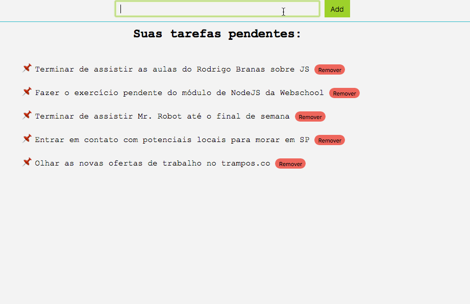
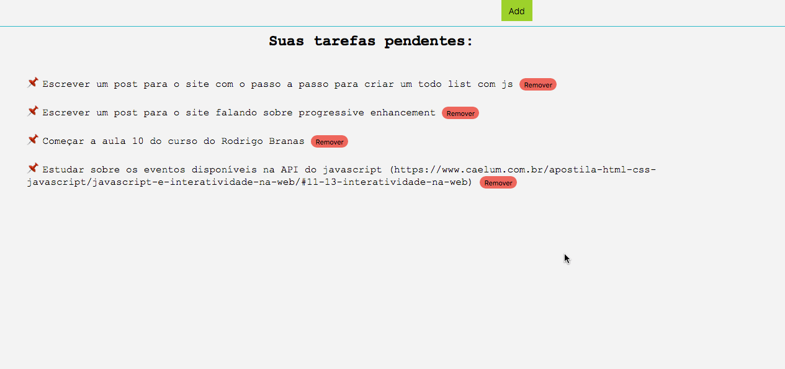

Decidi escrever este post para falar um pouco sobre uma API muito interessante do HTML, mas que pouco ouvimos falar a respeito. O que também me motivou a escrever este conteúdo, é que recentemente percebi que consigo fixar melhor o que estudo quando tenho a oportunidade de fazer anotações sobre o assunto. Se você der uma olhada no meu [GitHub](https://github.com/JulianoPadilha), verá que estou de fato colocando isso em prática e tomando anotações como parte do meu método de aprendizado. 🤓

Pretendo tornar este tipo de conteúdo uma série dentro do meu site chamada "How to Build". Acredito que será bem interessante e pretendo abordar os mais diversos assuntos, e claro, mostrar como se faz na prática, com uma pitada de teoria. Então vamos lá?! 

## O que é Web Storage?

Web Storage faz parte da API do HTML e fornece mecanismos para que os navegadores possam armazenar dados através de chave/valor de uma forma mais eficiente que os cookies. A API do Web Storage fornece duas maneiras de armazenar dados:

- `sessionStorage`
O sessionStorage mantém as informações armazenadas por origem e permanece disponível enquanto há uma sessão aberta no navegador(mesmo a página sendo recarregada). Caso o browser seja fechado a sessão será limpa e as informações serão perdidas.

- `localStorage`
O localStorage é muito parecido com o sessionStorage, a diferença é que mesmo que o navegador seja fechado, os dados permanecem armazenados.

Com Local Storage, aplicações web podem armazenar dados localmente no navegador do usuário. Antes do HTML5, os dados de uma aplicação tinham que ser armazenados em cookies. Com Local Storage é mais seguro realizar esse processo e grandes quantidades de dados podem ser armazenados localmente, sem afetar o desempenho do site.

Ao contrário dos cookies, o limite de armazenamento é muito maior (pelo menos 5MB) e a informação não é transferida para o servidor.

Local Storage é muito útil, por exemplo, em sites de e-commerce, onde o usuário pode ter adicionado algo no seu carrinho de compras e fechado o navegador. Quando ele retornar para o site, os itens do seu carrinho continuarão lá disponíveis, isso porque as informações foram armazenadas no Local Storage do seu browser. 

Esses mecanismos estão disponíveis a partir das seguintes propriedades `Window.sessionStorage` e `Window.localStorage` (para um maior suporte, o objeto Window implementa os objetos  Window.LocalStorage e Window.SessionStorage) — ao invocar uma dessas propriedades, é criada uma instância do objeto Storage, que fornece métodos para inserir, recuperar e remover os dados.

>Fonte: [Mozilla Developer - Web Storage API](https://developer.mozilla.org/pt-BR/docs/Web/API/Web_Storage_API_pt_br)

## Propriedades

`Storage.lenght`
Retorna um inteiro que representa o número de itens de dados armazenados no objeto de armazenamento.

## Métodos

`Storage.key()`
Retorna o nome da chave passada como parâmetro.

`Storage.getItem()`
Quando passado o nome de uma chave, retornará o valor dessa chave.

`Storage.setItem()`
Quando passado o nome de uma chave, adicionará a chave no storage ou atualizar o valor da chave caso ela já exista.

`Storage.removeItem()`
Quando passado o nome da chave, removerá a chave do storage.

`Storage.clear()`
Quando chamada, esvaziará todas as chaves fora do armazenamento.

## Chega de teoria! Let's make things happen!

Esse será o resultado final do nosso "How to Build" de hoje. Não está bonito, eu sei, seu sei.. Mas a ideia não era essa, a ideia é aprender os fundamentos de algo novo. Então fique a vontade para deixar o seu to-do list esteticamente mais bonito que o meu. 😉



### Estrutura de pastas e arquivos

Para nosso exemplo usaremos algo simples para nossa estrutura de pastas e arquivos:

```
📁 app
|___ index.html
|___ style.css
|___ todo.js
```

### index.html

Nossa página HTML também é super simples. De importante que devemos nos atentar, temos: 
- O elemento `input` que vai servir para a entrada dos nossos dados;
- O elemento `button` que irá ser o principal responsável por diversas ações da aplicação;
- Os dois elementos `div` que irão ser responsáveis, respectivamente, por exibir uma mensagem para o usuário dependendo do status da sua lista de tarefas e listar todo os nossos to-do's


```html
<!DOCTYPE html>
<html>
<head>
    <meta charset="utf-8">
    <meta name="viewport" content="width=device-width, initial-scale=1.0, user-scalable=yes">

    <link rel="stylesheet" type="text/css" href="style.css">

    <title>To-Do List</title>
</head>
<body>
    <div class="header">
        <input type="text" id="todo">
        <button id="add">Add</button>
    </div>
    <hr>

    <div id="msg"></div> // Usaremos essa div para exibir uma mensagem dependendo do status do nosso storage 
    <div id="todos" class="todos"></div> // Usaremos essa div para exibir a nossa lista de to do's

    <script src="todo.js"></script>
</body>
</html>
```

Sussa?! Keep going!

### todo.js

É aqui que a brincadeira começa a ficar interressante. _Muahahaha_ 

Como dito na parte teórica, o Web Storage dispõe do `sessionStorage` e do `localStorage`. Como nossa intensão é manter nosso to-do list mesmo após o navegador ter sido fechado, então neste exemplo usaremos apenas o localStorage. 

Aaah, uma dica inicial. Vocês podem acompanhar o que está acontecendo no Local Storage de vocês acessando a aba Resources do Inspector de elementos do Chrome (torço que estejam utilizando o Chrome :P), como mostra o gif abaixo.



Explicarei comentando trecho por trecho o que está acontecendo no código. 🤘

```js
var addTodo = function(){
    var todo = document.getElementById('todo').value; // Pega o valor digitado no input e armazena na variável 'todo'.

    var todos = getTodos(); // Chamamos em uma variável a função 'getTodos' que cria um array que traz todas as todos salvas antes de inserir uma nova.

    if(todo){ // Verifica se há algum conteúdo preenchido dentro do input
        todos.push(todo); // Utilizamos o push para jogar o elemento armazenado na variável 'todo' para nosso Array.

        localStorage.setItem('todos', JSON.stringify(todos)); // Utilizamos o localStorage.setItem para "persistir" as informações no storage do browser. Com parâmetro passamos a chave e o valor, usando 'JSON.stringify' para transformar o valor em uma string.

        document.getElementById('todo').value = ''; // Retorna para vazio o input após um item ser inserido.
    }

    document.location.reload(true); // Utilizamos o reload(true) para após a função ser realizada atualizar a tela.
}

var getTodos = function(){
    var todos = []; // Cria um array vazio caso não tenha nada já armazenado.

    var todos_string = localStorage.getItem('todos'); // Pega o conteúdo/valor da chave 'todos' do 'localStorage' e armazena na variável 'todos_string'

    if(todos_string != null){ // Verifica se o array de elementos não é nulo. Caso true então retornará a conversão de um JSON string para um Javascript data.
        return JSON.parse(todos_string);
    }
}

var showTodos = function(){
    var todos = getTodos(); // Guardamos em uma variável chamada 'todos' todos os todos que temos armazenadas utilizando a função getTodos;

    var html = '<ul>'; // Criamos uma variável 'html' que irá concatenando a nossa estrutura HTML.

    todos.forEach(function(elemento, index){ // Criamos um forEach para iterar todos os elementos do nosso Array. Utilizamos 'todos' na frente para referenciar de qual lugar estamos trazendo os elementos. 
        html += '<li> 📌 ' + elemento + '<button class="remove" id="'+ index +'">Remover</button></li>'; // Novamente utilizamos a variável 'html' para concatenar nosso HTML passando o 'elemento' que referencia os itens pertencentes os todos. 'index' representa nosso index dentro do array.
    });

    html += '</ul>'; // Fechamos a concatenação.

    document.getElementById('todos').innerHTML = html; // Inserimos o conteúdo da variável 'html' dentro da 'div' que contém o id 'todos'. O innerHTML serve justamente para inserir novos conteúdos.

    var buttons = document.getElementsByClassName('remove'); // Pegamos todos os elementos do DOM que possuem a class 'remove' e armazenamos na variável 'buttons'.

    for (var i=0; i < buttons.length; i++){ // Iteramos nossos elementos e adicionamos para cada elemento com a class 'remove' o addEventListener conectado com o evento 'click' e o callback da função 'removeTodo'.
        buttons[i].addEventListener('click', removeTodo);
    };
}

var removeTodo = function(){
    var id = this.getAttribute('id'); // Criamos uma variável id para receber o atual objeto-DOM referente ao id do botão remover que o usuário clicar. O this representa o objeto-DOM atual.

    var todos = getTodos(); // Guardamos em uma variável chamada 'todos' todos os todos que temos armazenadas utilizando a função getTodos;

    todos.splice(id, 1); // Utilizamos o método splice para remover um elemento específico. Como parâmetro passamos o id referente ao elemento que será removido do array e o valor "1", que representa que estamos realizando apenas uma remoção.

    localStorage.setItem('todos', JSON.stringify(todos)); // Após o elemento ser removido, utilizamos novamente o setItem para salvar a nossa nova lista de array.

    document.location.reload(true); // Utilizamos o reload(true) para após a função ser realizada atualizar a tela.
}

var hasTodo = function(){ // Função que verifica se há algum todo salvo dentro do Array do localStorage.

    var todos = getTodos(); // Guardamos em uma variável chamada 'todos' todos os todos que temos armazenadas utilizando a função getTodos;

    if(todos == ''){ // Utilizamos uma condicional para exibir uma mensagem na tela de acordo com o status do nosso array.
        text = '<h2>Não há tarefas cadastradas!</h2>';
        document.getElementById('msg').innerHTML = text;
    } else {
        text = '<h2>Suas tarefas pendentes:</h2>';
        document.getElementById('msg').innerHTML = text;
    }
}

document.getElementById('add').addEventListener('click', addTodo); // Buscamos o elemento contendo o id igual a 'add' e em seguinda utilizamos o método 'addEventListener' com o evento de 'click' e o callback que será chamado, no caso, nossa função addTodo.

window.addEventListener('keydown', function(event){ // Inserimos uma alternativa para a inserção os elementos, que é pressionando a tecla 'enter'. Para este caso precisamos passar um parâmetro que é uma função que recebe o evento com a keyCode que pressionamos. Depois verificamos se é true e caso seja chama o addTodo(); 
    if(event.keyCode == 13){
        addTodo();
    };
}); 

hasTodo(); // Passamos a função aqui para verificar antes mesmo de listar nossos elementos se o array é vazio ou não.

showTodos(); // Chamamos a função showTodos() para mostrar na telas os elementos do nosso array.
```

Espero que tenha ficado claro. E por fim, vamos para o CSS só para fechar com chave de ouro. Ou não.

### style.css

```css
* {
    margin: 0;
    padding: 0;
}

body {
    font-family: "Courier New", Courier, monospace;
    background-color: #F3F3F3;
    width: 100%;
    height: 100%;
}

.header {
    width: 470px;
    height: 50px;
    margin: 0 auto;
    position: relative;
    top: 8px;
}

.header input {
    width: 400px;
    height: 30px;
    border: none;
    text-indent: 10px;
}

.header input[type="text"] {
    font-size: 14px;
}

.header input:focus {
    outline-color: #99D04E;
}

.header button {
    width: 50px;
    height: 34px;
    background-color: #99D04E;
    border: none;
    font-size: 14px;
    font-weight: lighter;
}

hr {
    border: none;
    background-color: #00BBC7;
    color: #00BBC7;
    height: 1px;
}

h2 {
    width: 400px;
    margin: 0 auto;
    padding: 10px 0 20px 0;
}

.remove {
    background-color: #F46560;
    border: none;
    box-shadow: none;
    width: 60px;
    height: 20px;
    margin: 0 0 0 10px;
    border-radius: 25px;
    cursor: pointer;
}

.tasks {
    width: 100%;
}

ul li {
    list-style: none;
    margin: 20px 200px 0px 50px;

}
```


E assim finalizamos nosso To-Do List utilizando JavaScript e a API localStorage. Espero que tenha sido útil, e fico super aberto para feedbacks sobre como melhorar a didática dos exemplos e tudo mais. Também aceito com todo prazer feedbacks sobre o código, o que pode ser melhorado, o que tá errado, etc.. 

Até uma próxima! ✌️ 