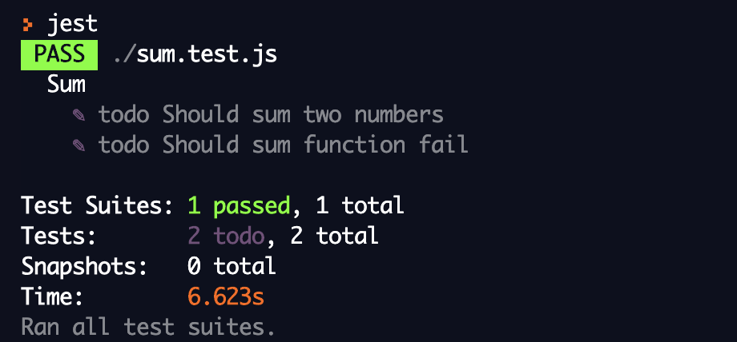

Esquecer de escrever testes pode ser mais comum do que imaginamos, principalmente se você não trabalha com algum processo que priorize a escrita de testes, como o TDD, ou se você estiver muito imerso no que está sendo desenvolvido e acaba deixando os testes para um segundo momento.

Se você está utilizando o [Jest](https://jestjs.io/en) como framework de teste, existe um método que nos permite declarar `todos` nos nossos arquivos de testes.

**ANTES**
```js
describe('Sum', () => {
  it('Should sum two numbers', () => {}); // vai passar mas sem testar nada =(
  it('Should sum function fail'); // vai falhar =(
});
```

**DEPOIS**
```js
describe('Sum', () => {
  it.todo('Should sum two numbers'); // vai aparecer como um TODO na nossa suite de testes
  it.todo('Should sum function fail'); // vai aparecer como um TODO na nossa suite de testes
});
```

### E como fica quando executamos nossos testes?

A melhor parte é que o Jest nos mostra de forma clara se temos testes em TODO e quantos são.


Uma boa prática no uso do `todo`, é durante o desenvolvimento ir inserindo os cenários de testes para depois não precisar ficar lembrando dos cenários que você gostaria de testar e acabar deixando de testar algo. =)


